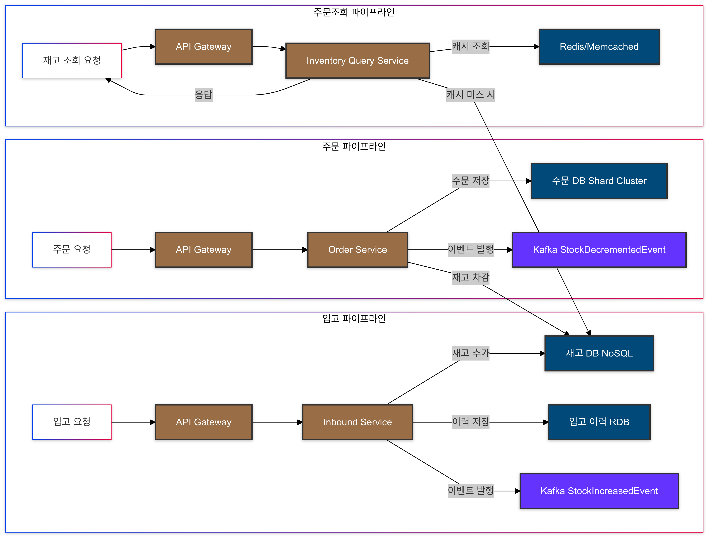

## Architecture Diagram

# 아키텍처 설계 문서

## 개요 (Overview)
본 아키텍처는 초고 트래픽(초당 수백만 TPS)에 대응하기 위한 재고 조회/주문/입고 시스템을 설계한 것이다. 이벤트성 상품(예: 갤럭시 이벤트)으로 재고 조회 요청이 폭증할 때, 재고 상태를 효과적으로 관리하고 빠른 응답을 제공하기 위해 NoSQL 및 캐시, 이벤트 기반 구조를 활용한다.

## 목표 (Goals)
- **초고속 재고 조회 처리**: 재고 조회 API 요청에 대해 마이크로초~밀리초 단위 응답을 제공.
- **유연한 확장성(Scalability)**: 트래픽 증가에 따라 무중단으로 수평 확장 가능한 구조.
- **고가용성(High Availability)**: 장애 발생 시에도 서비스를 지속적으로 제공할 수 있는 구조.
- **데이터 정합성(Consistency) 유지**: 주문/입고 시점에 재고량 정확성 보장.

## 요구사항 (Requirements)
- 초당 5,000,000 건 이상의 재고 조회 요청 처리.
- 특정 이벤트 상품에 대한 조회 폭증 시에도 안정적인 응답 시간 유지.
- 주문 처리 시 재고가 부족하면 에러 반환.
- 입고 처리 시 재고 수량 증가 반영.
- 외부 시스템(배송, 결제 등)과의 비동기 연동

1. **API 레이어**:
    - API Gateway를 통해 재고 조회(API), 주문 처리(API), 입고(API)를 라우팅.
   
2. **데이터 레이어 (NoSQL + 캐시)**:
    - **NoSQL**: 재고 상태를 Key-Value 또는 Wide-Column 형태로 관리.
    - **캐시(Redis/Memcached)**: 초고속 조회를 위한 인메모리 캐싱. 특정 "핫아이템"만 캐시해 비용 및 메모리 사용 최적화.
    - **RDB(샤딩된 클러스터)**: 주문 영구 저장 및 SKU/Vendor_Item 메타데이터 관리.

3. **이벤트 기반 처리 레이어**:
    - 메시지 브로커(Kafka 또는 RabbitMQ)를 통한 비동기 이벤트 처리.
    - 주문 이벤트 발행 후, 재고 서비스 또는 주문 서비스가 이벤트를 구독해 상태 변경.
    - 외부 시스템 통지 및 Saga(필요 시) 패턴으로 확장 가능.

## 기술 선택 근거 (Technology Choices)

### NoSQL 선택 이유 (Cassandra 또는 MongoDB)
- **Cassandra**:
    - 선형적 스케일 아웃(노드를 추가하면 읽기/쓰기 처리량이 선형적으로 증가)
    - 높은 쓰기 성능과 빠른 읽기 응답
    - Masterless 아키텍처로 노드 장애 발생 시에도 자동 페일오버 및 높은 가용성
    - 파티션 키를 통한 균등한 부하 분산

- **MongoDB**:
    - Document 지향 모델로 유연한 스키마 관리
    - Sharding 기능을 통해 수평 확장 가능
    - 풍부한 Secondary Index 지원(단, 인덱스 관리 비용 고려)
    - 범용적인 데이터 모델링이 유리할 경우 선택

**결정 포인트:**
- 재고 조회/차감과 같이 단순 Key 기반 접근 및 선형적 확장성이 중요한 경우 Cassandra를 선호
- SKU나 Vendor_item에 대한 다양한 질의 패턴, 문서 형태 저장이 유용하다면 MongoDB 고려
- 본 아키텍처는 **단순 키 기반 조회(fulfillment_center_id:sku_id)로 재고 접근**하므로 Cassandra를 추천 
- Cassandra는 TPS 증가 시 노드를 추가해 성능을 거의 선형적으로 올릴 수 있고, 쓰기/읽기 모두 짧은 레이턴시를 제공함

### 메시지 브로커 (Kafka 또는 RabbitMQ)
- Kafka: 고성능, 파티션 기반 확장, 주문 이벤트와 같은 대량 이벤트 처리에 적합
- RabbitMQ: 메시지 라우팅 플렉서블, 다양한 프로토콜 지원, 소규모 이벤트 처리에도 용이

**결정 포인트:**
- 대용량 스트림성 이벤트와 확장성 중시 → Kafka
- 복잡한 라우팅, 다양한 패턴 지원 필요 → RabbitMQ

## 읽기/쓰기 TPS 증가 시 고려사항

### 읽기 TPS 증가 (재고 조회)
- 캐시 에 해당하는 재고를 Redis 에 상주시켜 마이크로초 단위 응답
- NoSQL 파티션 키 설계로 특정 노드에 과부하가 가지 않도록 분산
- 읽기 TPS 5,000,000에서 Cassandra 클러스터 노드 수를 수십 대까지 확장 가능 (실제 노드 수는 HW 스펙에 따라 상이)
- Redis 클러스터링 및 샤딩으로 In-memory 캐시 확장

### 쓰기 TPS 증가 (주문/입고)
- 쓰기 부하 증가 시 Cassandra의 선형적 스케일링 활용: 노드 추가로 Write TPS 확장
- Cassandra는 수만~수십만 TPS 수준의 쓰기에도 노드 증설로 대응 가능
- MongoDB 샤딩 시 각 샤드에 쓰기 부하를 분산, 샤드 추가로 수평 확장
- 이벤트 버스(Kafka) 파티션 증가로 주문 이벤트 처리량 증가
- Inbound 및 Order Command 처리량 증가 시 마이크로서비스 인스턴스 수 확대(Auto scaling)로 대응

### 가용성과 동시성
- Cassandra: 노드 n개 중 Replication Factor 에 따라 노드 장애에도 읽기/쓰기가 가능한 Eventual Consistency 기반. 가용성 99.99% 이상 확보 가능
- Redis Cluster: 리더-팔로워 구조를 통한 자동 fail-Over, M 가용성을 위한 다중 Replica 구성
- Kafka: Partition Replication 및 broker 장애 시 리더 전환으로 높은 가용성
- 마이크로서비스: Stateless 설계로 인스턴스 장애 시 LB+Auto Scaling 을 통해 무중단 서비스

**수치 예시**(가정):
- Cassandra 노드 10대 구성 시 초당 수백만 건 읽기 + 수십만 건 쓰기 처리 가능 (하드웨어 스펙 및 최적화에 따라 변동)
- Redis 샤드 5~10개, 각각 단일 샤드당 수십만 TPS 처리 가능(메모리 및 네트워크 환경에 따라 상이)
- Kafka 파티션 100개 이상으로 분할하면 수십만~수백만 TPS 이벤트 처리 가능(브로커 수 및 디스크/네트워크 스펙 고려)

## 데이터베이스 및 캐시 구조

- **재고 DB (Cassandra)**:
    - Partition Key: `fulfillment_center_id`
    - Clustering Key: `sku_id`
    - Value: 재고 수량(stock_count), 마지막 업데이트 시각 등
    - 조회/쓰기는 Key 단위 O(1)에 가까운 접근 제공

- **재고 캐시 (Redis)**:
    - Key: `fulfillment_center_id:sku_id`
    - Value: 재고 수량
    - TTL 또는 히트율 기반으로 핫아이템만 유지

- **주문 DB (Shard RDB)**:
    - 주문 데이터를 샤드 키(예: 주문 생성 시점, User ID 등)에 따라 여러 DB에 분산.
    - Shard 추가 시 수평적 확장으로 읽기/쓰기 부하 분산
